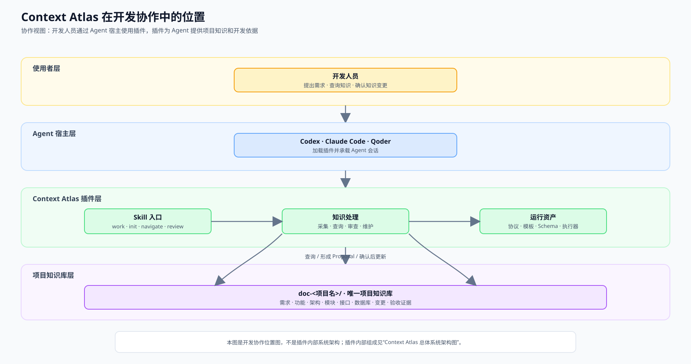
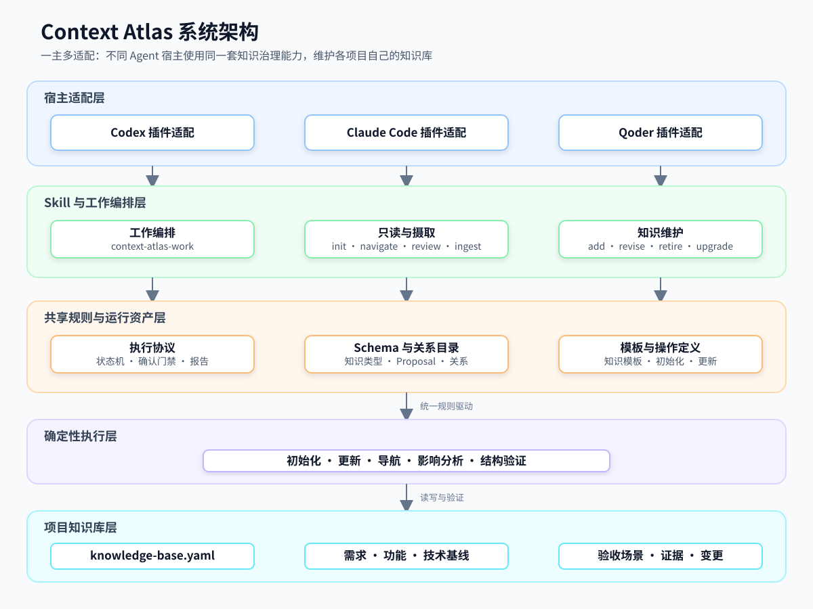
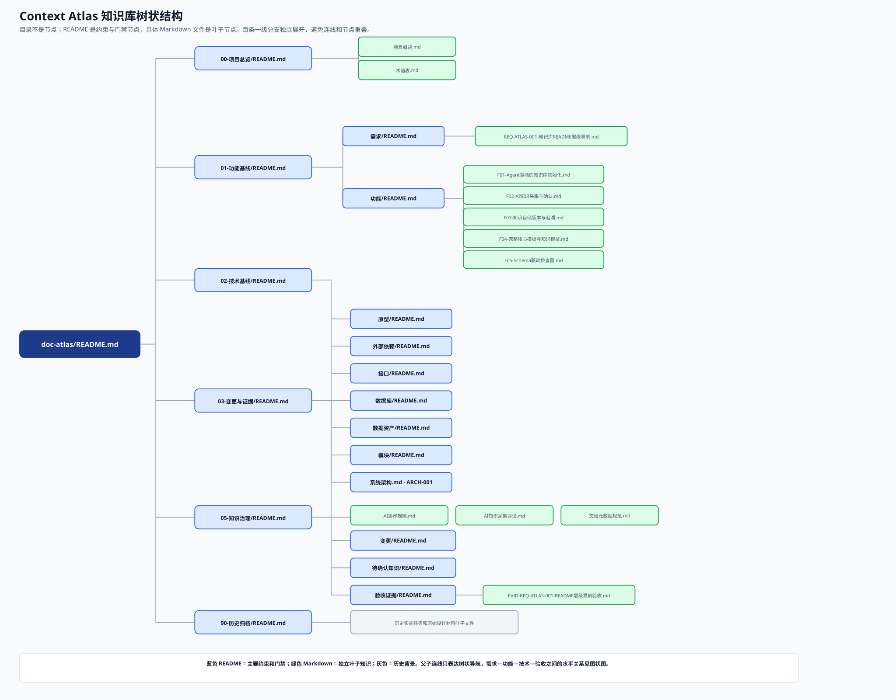
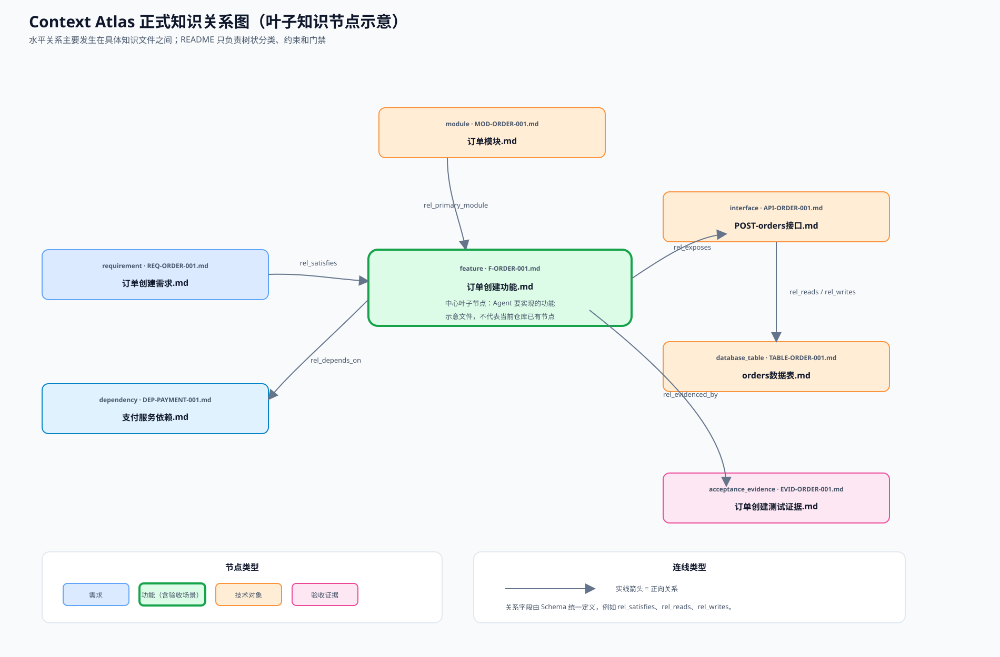

# Context Atlas 开发手册

> 面向项目开发人员的使用说明。
>
> 本文位于 `doc-atlas/Clippings/`，是阅读手册，不是正式知识库条目。它帮助开发人员在自己的项目中使用 Context Atlas；其中的项目事实、命令版本和宿主能力，以目标项目、宿主环境及当前插件版本为准。

## 一、概述：Context Atlas 是做什么的

Context Atlas 是一个供 Codex、Claude Code 和 Qoder 使用的 Agent 插件。它为每个项目建立一套可持续维护的知识库，把开发过程中容易散落的信息集中起来：

- 项目目标、范围和术语；
- 需求、功能和业务规则；
- 系统架构、模块边界、接口和数据库；
- 设计决策、变更、验收场景和验证证据；
- 来源、未知项、冲突和知识之间的关系。

它的核心价值是：开发人员不需要每次都重新向 Agent 解释项目背景，Agent 也不能把猜测直接当成项目事实。开发人员可以先让插件查询和审查现有知识，再进行编码；开发完成后，再把经过验证、长期有效的变化回写到知识库。

### 1.1 它解决什么问题

没有统一知识库时，常见问题包括：

- 需求在 Issue，接口在代码，数据库约束在迁移，验收标准在聊天记录中；
- 新成员或新 Agent 不知道哪个文档是当前有效版本；
- 修改接口或数据库后，关联功能、测试和验收项没有同步；
- “测试通过”被误解为“业务已经确认”；
- 排查过程中的猜测被误写成长期事实。

Context Atlas 用项目内唯一的 `doc-<项目名>/` 知识库和可追溯关系解决这些问题。

### 1.2 它不负责什么

Context Atlas 不替代：

- Issue、项目管理工具或开发任务排期；
- OpenSpec、Spec Kit 等规格或设计工具；
- IDE、代码生成器、测试框架、CI/CD 和部署系统；
- 项目负责人对业务结果的最终确认。

一句话理解：Context Atlas 管理“项目知识和证据”，开发工具负责“执行开发任务”。

### 1.3 开发人员什么时候使用

| 时机          | 使用目的                   |
| ----------- | ---------------------- |
| 接手已有项目      | 了解项目目标、技术结构、约束和当前验收状态  |
| 开发新功能       | 查询相关基线、明确范围并形成可验收的开发依据 |
| 修改接口或数据库    | 找到影响范围，避免只改代码不改知识      |
| 排查缺陷        | 区分已知事实、实际观察和未验证假设      |
| 完成功能开发      | 对照基线记录实现差异、测试结果和验收证据   |
| 摄取会议纪要或设计文档 | 将外部资料整理为可确认的知识候选       |

## 二、总体设计：开发人员需要理解的模型

### 2.1 一项目一套知识库

目标项目根目录通常包含：

```text
业务仓库/
├─ AGENTS.md 或 CLAUDE.md
└─ doc-<项目名>/
   ├─ README.md
   ├─ knowledge-base.yaml
   ├─ Clippings/              # 临时资料和阅读手册
   ├─ 00-项目总览/             # 目标、范围、术语
   ├─ 01-功能基线/             # 需求、功能
   ├─ 02-技术基线/             # 架构、模块、接口、数据库
   ├─ 03-变更与证据/           # 变更、验收、实现证据
   ├─ 05-知识治理/             # 项目知识维护规则
   └─ 90-历史归档/             # 已被替代的历史内容
```

开发人员主要关注四类内容：

1. `01-功能基线`：系统应该提供什么行为；
2. `02-技术基线`：由哪些模块、接口、数据库和依赖实现；
3. `03-变更与证据`：本次开发改变了什么，以及如何验证；
4. `05-知识治理`：如何确认、更新和维护知识。

`Clippings/` 是资料暂存区。放入其中的文档不会自动成为正式项目事实。

### 2.2 Context Atlas 在开发协作中的位置

下面这张图只展示 Context Atlas 的职责边界。主路径是：开发人员 → Agent 宿主 → Context Atlas → 项目知识库；项目代码、IDE、测试框架和部署系统属于外部开发体系，不是插件架构的一部分。



Context Atlas 的核心是项目知识库：收录并治理需求、功能、架构、模块、接口和数据库等项目知识，并将已确认的知识提供给 Agent 作为开发依据。功能验收场景写在对应功能文档中，功能完成后的测试、构建和验收结果以可定位的验收证据进行记录。

### 2.3 Context Atlas 总体系统架构

上一张图回答“插件在开发协作中的位置”；本图回答“插件内部由什么组成”。插件采用“一主多适配”设计：不同宿主通过平台适配层调用同一套核心 Skill、协议、Schema 和确定性执行器。



系统架构中的职责边界如下：

| 层次         | 职责                                                    |
| ---------- | ----------------------------------------------------- |
| 宿主适配层      | 让 Codex、Claude Code 和 Qoder 能以各自的插件格式加载 Context Atlas |
| Skill 层    | 接收开发人员请求，选择查询、审查、摄取、维护或升级操作                           |
| 共享规则与运行资产层 | 统一定义知识格式、关系、Proposal、确认门禁和操作规则                        |
| 确定性执行器     | 执行初始化、更新、导航和结构验证，保证结果可重复                              |
| 项目知识库层     | 保存项目需求、功能、技术基线、治理规则、验收场景和实现证据                         |

开发人员通常不直接操作协议、Schema 或执行器，而是通过宿主中的 Skill 使用插件。插件运行资产也不属于业务项目知识；它们只是帮助 Agent 正确读写和验证知识库的公共能力。

### 2.4 知识库的垂直结构：树状层级

树状图只表达知识库的目录层级和分类归属：知识项属于哪个目录、目录下有哪些子分类。它不表达业务依赖，也不代表功能调用关系。



### 2.5 正式知识的水平结构：关系图

图状图表达具体知识文件之间的业务和技术关系。本手册中的图是跨项目的正式知识关系示意图，以一个功能文件为中心，展示需求、模块、接口、数据库、外部依赖，以及功能文档中内嵌的验收场景对应哪些实现证据。示意节点不代表当前 `doc-atlas` 已经存在这些业务文件。



两种结构的区别是：树状结构回答“知识放在哪里”，图状结构回答“知识与什么相关”。目录归属通过 `rel_classified_under` 表达；业务和技术关系使用 Schema 登记的 `rel_<type>` 字段表达，不能用目录层级替代。实际项目的关系图应根据当前知识库中已经存在的叶子节点和正式关系生成；历史归档节点、Clippings 和不存在的技术对象不应当作为当前正式链路展示。

### 2.6 一次开发任务的知识流

```text
开发人员描述任务
        ↓
插件读取项目知识、源码和来源
        ↓
返回当前约束、影响、未知项和建议
        ↓
开发人员决定是否建立或更新知识基线
        ↓
Agent 依据已确认的需求、功能和技术知识开展开发
        ↓
根据功能验收场景验证实现并形成证据
        ↓
回写经过确认的长期知识、变更和验收证据
```

正式知识更新有确认门槛：

```text
inspect → propose → await_confirmation → apply → validate → report
```

开发人员可以让插件自由查询和分析，但正式知识只有在开发人员或项目责任人明确确认当前 Proposal 后才会写入。

### 2.7 Skill 速查

| 开发目的           | Codex                     | Claude Code                             | 是否修改正式知识             |
| -------------- | ------------------------- | --------------------------------------- | -------------------- |
| 自动编排一次开发目标     | `$context-atlas-work`     | `/context-atlas:context-atlas-work`     | 默认只读；确认 Proposal 后可写 |
| 初始化新项目知识库      | `$context-atlas-init`     | `/context-atlas:context-atlas-init`     | 确认后初始化               |
| 查询知识和关系        | `$context-atlas-navigate` | `/context-atlas:context-atlas-navigate` | 否                    |
| 审查需求、设计或验收是否就绪 | `$context-atlas-review`   | `/context-atlas:context-atlas-review`   | 否                    |
| 摄取会议纪要、网页或文档   | `$context-atlas-ingest`   | `/context-atlas:context-atlas-ingest`   | 只生成候选，不直接写入          |
| 新增知识           | `$context-atlas-add`      | `/context-atlas:context-atlas-add`      | 确认后新增                |
| 修订或替代知识        | `$context-atlas-revise`   | `/context-atlas:context-atlas-revise`   | 确认后修订                |
| 退役无后继知识        | `$context-atlas-retire`   | `/context-atlas:context-atlas-retire`   | 确认后退役                |
| 升级知识库格式        | `$context-atlas-upgrade`  | `/context-atlas:context-atlas-upgrade`  | 确认后升级                |

通常开发人员只需使用 `context-atlas-work`；需要单独查询时使用 `navigate`，需要单独审查规格时使用 `review`。

## 三、开发规范：开发人员在项目中应遵守什么

本节不是 Agent 的执行规则，而是开发人员使用 Context Atlas 时应遵守的项目协作规范。

### 3.1 开发前先查当前基线

开始编码前，应确认：

- 要解决的问题、目标用户和业务价值；
- 本次范围和明确不做的内容；
- 正常行为、失败行为和边界条件；
- 受影响的功能、模块、接口、数据库和外部依赖；
- 安全、性能、兼容性和数据约束；
- 可执行、可观察、可复现的验收标准。

如果这些内容会影响方案或任务拆分，应先补充或确认，不要让开发人员和 Agent 各自按假设实现。

### 3.2 变更代码时同步考虑知识影响

以下变更至少要检查知识库是否需要更新：

- 增加、删除或改变接口行为；
- 增加、删除或改变数据库表、字段、索引和数据关系；
- 改变模块职责、依赖方向或外部服务；
- 改变权限、安全、兼容性、性能或数据生命周期；
- 新增可长期复用的业务规则或故障原因。

代码提交、Issue 关闭或测试通过，不等于知识库已经更新。

### 3.3 用证据说话

开发人员提交或确认知识时，应提供可定位证据，例如源码文件和行号、接口测试请求与响应、迁移文件、测试或构建命令、日志、监控、实际操作记录，以及业务负责人对验收结果的明确确认。

一次性日志、未经复现的猜测和临时排查笔记不要写成正式知识。

### 3.4 不记录敏感信息

禁止将密码、Token、私钥、数据库连接密钥和未脱敏个人信息写入知识库、手册或 Proposal。可以记录环境变量名称、配置文件位置和脱敏后的配置说明。

### 3.5 处理冲突时保留事实来源

如果代码、文档、Issue 或不同责任人的说法不一致：

1. 记录各自来源和版本；
2. 明确冲突会影响哪些功能或实现；
3. 请项目责任人裁决；
4. 不要自行选择“看起来最新”或“看起来合理”的内容。

## 四、开发流程：一条从需求到交付的主线

本节回答“一个开发任务从开始到结束怎么走”。它描述时间顺序；下一节的“场景实践”描述遇到某类具体任务时怎么操作。

### 阶段 1：接收任务并定位知识

开发人员向 Agent 说明目标、使用者、范围、已知约束和期望结果。优先使用：

```text
请使用 context-atlas-work，先查询与“功能名称”相关的需求、功能、模块、接口、数据库和验收场景，
再说明当前基线、影响范围、未知项和建议。本轮先分析，不写入正式知识。
```

### 阶段 2：确认开发基线

如果任务会产生长期有效的项目知识，开发人员选择“先建立知识基线再开发”，或“本轮只开发，完成后再回写知识”。需要建立基线时，审阅 Proposal 中的目标文件、事实、来源、推测、未知项、冲突、关系、影响和验证计划，然后确认精确的 `proposal_revision`。

### 阶段 3：实施代码和测试

按项目原有任务系统开发。Context Atlas 提供约束和影响信息，不替开发人员决定分支、任务排期、提交或部署。开发过程中若发现接口、数据库或设计与基线不一致，应立即记录差异，不要静默修改知识。

### 阶段 4：核对实现差异

完成编码后，对照基线检查实际模块和依赖、接口输入输出和错误、数据库结构、兼容性、安全性能约束，以及验收场景是否仍然覆盖实际行为。有稳定差异时，使用 `add`、`revise` 或 `retire` 生成维护 Proposal。

### 阶段 5：验收并沉淀证据

验收以需求承接的功能文档内嵌验收场景为中心：验证功能实现是否满足场景要求，并记录对应的实现证据；知识库结构和证据引用另行进行结构验证。最后由项目责任人确认功能验收结果。

## 五、场景实践：具体任务怎么用

本节是操作剧本。每个场景都说明“什么时候用、输入什么、插件做什么、开发人员拿到什么结果”。它不是另一条生命周期流程。

### 场景一：第一次把插件接入项目

**适用情况**：目标项目还没有 `doc-<项目名>/` 知识库。

**操作：**

```text
请使用 context-atlas-init 初始化当前项目知识库。
请调查项目 README、依赖、源码模块、接口、数据库、测试和构建配置，
列出项目目标、范围、技术基线、未知项、冲突和验证计划。
```

开发人员审阅初始化 Proposal，确认后插件才创建知识库。初始化后再执行一次导航冒烟，确认目录可以被查询。

**结果：** 项目根目录出现 `doc-<项目名>/`，其中包含机器入口、知识分类、模板、来源和治理说明。

**注意：** 已有知识库时不能再次初始化；存在多个 `doc-*` 时先指定哪个是当前权威。

### 场景二：接手项目，快速了解一项功能

**适用情况**：开发人员需要接手旧功能或陌生模块。

```text
请使用 context-atlas-navigate 查询“订单导出”相关的需求、功能、模块、接口、数据库、
外部依赖和验收场景。先返回摘要、文件路径、稳定 ID 和一跳关系，
不要把查询结果写入知识库。
```

先看功能和验收，再看具体模块、接口和数据库；需要多跳影响分析时才使用有深度和节点数限制的 graph 查询。

**结果：** 开发人员知道功能做什么、由哪些技术对象支撑、已有何种约束，以及哪些内容仍然未知。

### 场景三：开发一个新功能

**适用情况**：新增一个以前没有的业务能力。

```text
请使用 context-atlas-work 处理“租户批量导入”。
目标用户是租户管理员，输入为 CSV 文件，成功后创建租户记录。
请先查询现有租户、权限、文件上传、租户表和相关验收场景，
审查范围、失败行为、幂等性、数据校验和权限约束。
先给出开发前基线和仍需责任人决定的问题，不要直接写入。
```

开发人员确认范围和 Proposal 后开始编码。完成后补充实际接口、数据结构、测试和验收证据；如果实现与基线不同，再生成 `revise` Proposal。

**至少明确：** 参与者、前置条件、正常流程、失败流程、权限、输入输出、重复提交、数据一致性、性能边界和验收场景。

### 场景四：修改接口或数据库

**适用情况**：新增字段、改变响应、增加索引、拆分表或修改数据关系。

```text
请查询 POST /orders 接口及其关联功能、订单表、订单明细表和验收场景。
根据 migrations/V20260902__create_order_item.sql 分析新增 order_item 表的影响，
区分 DDL 能证明的结构、仍需确认的业务含义和需要迁移的调用方。
本轮先分析，不写入正式知识。
```

**开发人员要检查：** 调用方兼容性、空值和默认值、索引、数据迁移、回滚、历史数据、权限、接口版本和验收证据。

新表或新数据源使用 `add`；已有表的字段、索引或说明变化使用 `revise`；退出当前权威且没有后继项时使用 `retire`。

### 场景五：排查和修复缺陷

**适用情况**：线上或测试环境出现错误，需要判断是代码、配置、接口、数据库还是外部依赖问题。

```text
请查询“订单提交失败”涉及的功能、POST /orders 接口、订单表、事务约束和验收场景。
结合以下日志、配置和复现步骤定位问题：
1. 请求时间：2026-09-02 10:15
2. 错误：订单明细保存失败
3. 复现：同一订单重复提交
请分开列出已批准知识、当前观察、用户陈述和未验证假设；本轮先排查，不写入。
```

修复后验证原问题、正常路径、重复提交、异常回滚和兼容行为。只有确认了稳定故障原因或新增约束，才使用 `add` 或 `revise` 沉淀。

### 场景六：摄取会议纪要或设计文档

**适用情况**：需要把外部资料中的长期有效内容纳入项目知识。

1. 将文件放入 `doc-atlas/Clippings/`；
2. 显式调用 `context-atlas-ingest`；
3. 指定文件路径、作者、日期或版本；
4. 审阅每项结果是新增、修订、退役、冲突还是不沉淀；
5. 再调用对应维护 Skill 生成 Proposal；
6. 确认后才写入正式知识。

```text
请使用 context-atlas-ingest 摄取 doc-atlas/Clippings/支付改造评审纪要.md。
按会议结论、未决问题、设计决策、接口变化和验收要求分类，
标出来源、推测、冲突和不应沉淀的临时讨论。本轮只生成候选，不写入正式知识。
```

### 场景七：功能完成后的知识回写

**适用情况**：代码、测试和功能文档内嵌验收场景验证已经完成，需要让知识库与实际实现保持一致。

```text
请对照“租户批量导入”的开发前基线，检查当前代码、接口、数据库迁移、测试和构建结果。
列出实现差异、验收证据、遗留风险和需要新增或修订的知识。
请先生成 Proposal，不要直接覆盖现有知识。
```

**结果：** 一份差异和证据清单，以及需要 `add`、`revise` 或 `retire` 的明确目标。

## 六、开发环境：目标项目需要具备什么

本节描述“要在一个项目中使用 Context Atlas，项目和开发机器需要准备什么”。它不描述 Context Atlas 源码仓库的内部开发测试环境。

### 6.1 必需的项目条件

| 条件 | 要求 | 用途 |
| --- | --- | --- |
| Agent 宿主 | Codex、Claude Code 或 Qoder 任意一个 | 加载和调用插件 Skill |
| 项目仓库 | 可访问的 Git 项目根目录 | 读取源码、配置、迁移、测试和文档 |
| Python | Python 3 | 执行知识库初始化、导航和结构检查脚本 |
| Git | 可用的 Git 命令 | 读取项目版本、变更和提交证据 |
| Shell | Windows PowerShell；其他系统以宿主支持为准 | 执行安装和验证命令 |
| 项目权限 | 能读取项目文件，必要时能修改 `doc-<项目名>/` | 查询和维护项目知识库 |

Python 3 和 Git 是项目侧工具依赖，不代表要把 Context Atlas 作为 Python 包安装。Context Atlas 不使用 `pip install`。

### 6.2 目标项目的建议准备项

为了让插件能够形成有用的项目基线，目标项目最好已有：

- 项目根 README 或项目说明；
- 依赖清单和运行配置；
- 源码目录及模块说明；
- API 定义、数据库迁移或数据模型；
- 测试、构建和 CI 配置；
- Issue、设计文档或会议纪要等可定位来源。

缺少这些资料时插件仍可初始化，但缺失内容会被标记为未知项，不能由 Agent 自动补成事实。

### 6.3 环境检查

在目标项目中可先检查基础依赖：

```powershell
py --version
git --version
```

预期分别能输出 Python 3.x 和 Git 版本。然后确认宿主命令可用：

```powershell
codex --version
claude --version
qoder --version
```

实际只需要其中一个宿主；某个宿主未安装时，对应命令失败不影响其他宿主的使用。

## 七、资源下载与插件安装

本节完整说明插件的获取、安装、安装验证、升级和卸载。

### 7.1 资源获取方式

开发人员通常不需要下载源码、复制 `skills/` 目录或安装 Python 包。根据使用的 Agent 宿主，直接从对应的 Marketplace 发布源安装插件：

| 宿主 | 插件来源 | 推荐获取方式 |
| --- | --- | --- |
| Codex | [Context Atlas Codex 插件仓库](https://github.com/xiangzuoxiangyoukan7/context-atlas-codex-plugin) | 通过 Codex Marketplace 登记并安装 |
| Claude Code | [Context Atlas Claude 插件仓库](https://github.com/xiangzuoxiangyoukan7/context-atlas-claude-plugin) | 通过 Claude Code 项目级 Marketplace 安装 |
| Qoder | [Context Atlas Qoder 插件仓库](https://github.com/xiangzuoxiangyoukan7/context-atlas-qoder-plugin) | 通过 Qoder 项目级 Marketplace 安装 |
| 源码、构建和发布说明 | [Context Atlas 源码仓库](https://github.com/xiangzuoxiangyoukan7/context-atlas) | 仅用于维护插件或排查发布问题 |

安装时应使用与宿主匹配的发布仓库。源码仓库不是目标项目的运行目录，也不建议将构建产物手工复制到项目中。插件安装完成后，知识库仍保存在目标项目自己的 `doc-<项目名>/` 目录中。

### 7.2 安装前确认

1. 确认目标项目根目录和项目范围；
2. 确认已经安装 Codex、Claude Code 或 Qoder；
3. 确认 Python 3 和 Git 可用；
4. 关闭旧的 Agent 会话，安装完成后重新创建会话；
5. 不要把源码仓库中的 `skills/` 目录单独复制到项目或用户目录。

### 7.3 Codex：用户级安装，项目级启用

Codex 的插件实体、Marketplace 和缓存保存在用户级；目标项目通过 `.codex/config.toml` 启用。保持默认用户级 `CODEX_HOME`，不要把它指向项目的 `.codex/`。

首次安装：

```powershell
codex plugin marketplace add https://github.com/xiangzuoxiangyoukan7/context-atlas-codex-plugin.git
codex plugin add context-atlas@context-atlas
```

在目标项目的 `.codex/config.toml` 中启用：

```toml
[plugins."context-atlas@context-atlas"]
enabled = true
```

然后进入受信任的目标项目，新建 Codex 会话，并确认 `$context-atlas-work`、`$context-atlas-navigate` 等 Skill 可见。

### 7.4 Claude Code：项目级安装

在目标项目目录执行：

```powershell
claude plugin marketplace add --scope project https://github.com/xiangzuoxiangyoukan7/context-atlas-claude-plugin.git
claude plugin install --scope project context-atlas@context-atlas
```

不要省略两个命令中的 `--scope project`。安装后新建 Claude Code 会话，并确认 `/context-atlas:context-atlas-work` 等命令可用。

### 7.5 Qoder：项目级安装

在 Qoder 打开的目标项目范围中执行：

```powershell
qoder plugins marketplace add https://github.com/xiangzuoxiangyoukan7/context-atlas-qoder-plugin.git
qoder plugins install context-atlas@context-atlas
```

重启 Qoder，在输入框中输入 `/`，确认九个 Context Atlas Skill 已出现。不要安装到用户级 `~/.qoder/skills/`。

### 7.6 安装成功检查

安装后依次确认：

1. 宿主能显示 Context Atlas Skill；
2. 目标项目范围正确；
3. 能创建新会话并调用导航或初始化 Skill；
4. 已有知识库可以被查询；
5. 没有知识库时，`context-atlas-init` 能生成 Proposal；
6. 未确认 Proposal 前没有正式知识文件被修改。

第一条验证命令：

```text
已有知识库：请使用 context-atlas-navigate 导航当前项目知识库，并返回根目录的直接子项。
没有知识库：请使用 context-atlas-init 检查当前项目是否适合初始化，只输出 Proposal，不要写入。
```

### 7.7 升级和卸载

升级时以宿主显示的实际安装版本为准。三个宿主升级后都应新建 Agent 会话，并再次检查 Skill 是否完整加载。

#### 升级插件

Codex 的 Marketplace 只在首次登记时执行 `add`；升级时先刷新源，再移除并重新安装用户级插件：

```powershell
codex plugin marketplace upgrade context-atlas
codex plugin remove context-atlas@context-atlas
codex plugin add context-atlas@context-atlas
codex plugin list
```

Claude Code 在目标项目中按项目范围重新登记并安装：

```powershell
claude plugin marketplace remove --scope project context-atlas
claude plugin marketplace add --scope project https://github.com/xiangzuoxiangyoukan7/context-atlas-claude-plugin.git
claude plugin install --scope project context-atlas@context-atlas
```

Qoder 在 Marketplace 的 Project 范围更新：

```powershell
qoder plugins marketplace update context-atlas
qoder plugins update context-atlas@context-atlas
```

#### 卸载插件

卸载前确认是否还有其他项目依赖该插件。卸载插件只移除 Agent 的插件能力，不会删除目标项目中的 `doc-<项目名>/` 知识库。

Codex 的插件是用户级共享安装，完整卸载会影响该用户的所有项目：

```powershell
codex plugin remove context-atlas@context-atlas
codex plugin marketplace remove context-atlas
```

如果只是不想让某个项目使用 Codex 插件，应在该项目 `.codex/config.toml` 中删除插件启用项或将 `enabled` 设为 `false`，不要删除整个 `.codex/` 目录。

Claude Code 的项目级卸载：

```powershell
claude plugin uninstall --scope project context-atlas@context-atlas
claude plugin marketplace remove --scope project context-atlas
```

Qoder 应在插件管理界面选择目标项目的 Project 范围，卸载 `context-atlas` 并移除对应 Marketplace。不同 Qoder 版本的卸载命令可能不同，以界面显示的当前操作为准。

完成升级或卸载后，都应关闭旧会话并重新打开 Agent；升级后检查 Skill 是否完整，卸载后确认 Context Atlas Skill 不再出现在命令面板中。

## 八、常见问题

### 为什么插件只返回 Proposal，没有直接修改文件？

正式知识更新必须经过开发人员或项目责任人确认当前 Proposal 修订。这是为了避免 Agent 把推测、错误来源或过期设计直接写成项目事实。

### 我只想查询，不想更新知识，怎么说？

在请求中明确写“本轮只读分析，不写入正式知识”。也可以直接使用 `context-atlas-navigate` 或 `context-atlas-review`。

### 测试通过后还需要更新知识库吗？

需要检查实现是否与知识基线一致。测试证明实现满足技术预期，但不能证明接口说明、业务含义、设计决策和验收结果已经同步。

### `Clippings/` 里的手册或会议纪要是正式知识吗？

不是。它们是阅读资料或待摄取来源。只有经过摄取、路由、Proposal、确认和验证，内容才可能进入正式知识分类。

### 如何判断使用 `add` 还是 `revise`？

此前不存在的稳定身份用 `add`；已有身份的内容、约束或实现变化用 `revise`；无后继项并且不再有效时用 `retire`。

### 知识库中出现两个互相矛盾的说法怎么办？

保留双方来源、版本和影响，交给项目责任人裁决。不要自行删除旧说法，也不要以归档内容作为当前结论。

### 安装后找不到 Skill 怎么办？

新建 Agent 会话，确认插件安装范围、项目是否受信任、项目配置是否启用，并在宿主的 Skill 面板或 `/` 命令中检查实际安装版本和 Skill 列表。

### 多个项目能共用一个知识库吗？

不建议。插件可以共享安装，但每个项目应维护自己的 `doc-<项目名>/`，避免项目事实、来源和验收证据互相污染。

## 九、最小使用清单

开发人员可以按以下清单执行一次完整开发：

- [ ] 已安装并启用插件；
- [ ] 已确认目标项目的当前知识库；
- [ ] 已查询相关需求、功能文档内嵌验收场景、模块、接口和数据库；
- [ ] 已明确范围、非范围、失败行为和验收标准；
- [ ] 已识别安全、性能、兼容性和数据影响；
- [ ] 已决定本轮是否建立知识基线；
- [ ] 已完成编码、测试和构建；
- [ ] 已对照基线检查实现差异；
- [ ] 已记录可定位的实现和验收证据；
- [ ] 已完成必要的知识 Proposal 和功能验收确认。
